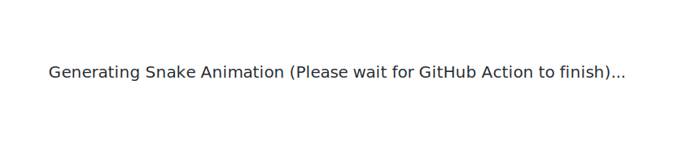

<!-- ====================================================== -->
<!--                       HEADER                          -->
<!-- ====================================================== -->

# Rafael Silva

---

# 👋 About Me

I'm a **Python Developer** passionate about building software that solves real business problems.

My main interests include:

- 🐍 Python Development
- 📊 Data Analysis
- 🤖 Process Automation
- 📱 Desktop & Mobile Applications
- 📦 Inventory Management Systems
- 🗄️ Databases
- 📈 Dashboards

I'm constantly learning new technologies and improving my software engineering skills through practical projects.

---

# 🚀 Current Focus

- Inventory Management Systems

- QR Code Applications

- Python Automation

- SQL

- PostgreSQL

- Data Analysis

- Dashboard Development

- Clean Code

---

# 🛠 Tech Stack

## Languages

---

## Tools

---

# 📚 Currently Learning

- Advanced Python

- PostgreSQL

- Data Engineering

- Software Architecture

- Business Intelligence

---

# 📌 Featured Projects

## 📦 Inventory Management System

A complete inventory system developed with Python and Flet.

**Features**

- QR Code Scanner

- Inventory Control

- Reports

- Dashboard

---

## 🤖 Python Automation

Automating repetitive tasks using Python.

---

## 📊 Sales Dashboard

Interactive dashboards built with Python and Excel.

---

## 📈 SQL Portfolio

Real-world SQL queries and data analysis projects.

---

# 📊 GitHub Statistics

---

# 🔥 Contribution Streak

---

# 📈 Contribution Graph

---

# 🐍 Contribution Snake

<picture>
  <source media="(prefers-color-scheme: dark)" srcset="./assets/github-stats/github-snake-dark.svg" />
  <source media="(prefers-color-scheme: light)" srcset="./assets/github-stats/github-snake.svg" />
  
</picture>

---

# 🌎 Connect with Me

---

### 💡 *"Technology is most valuable when it transforms complex problems into simple solutions."*

